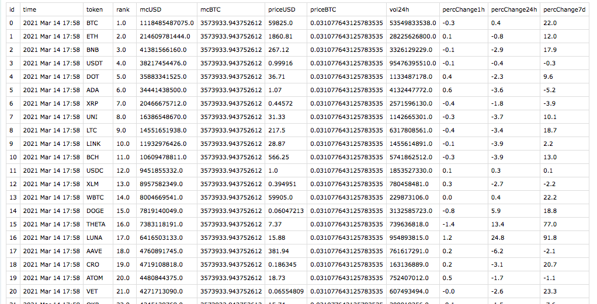

# top-100-coin-tracker

A script that builds a dataset containing the following metrics for the top 100 crypto-currencies sorted by market capitalization:

* Price (USD)
* Price (BTC)
* Market capitalization rank
* Market capitalization (USD)
* Market capitalization (BTC)
* Trading volume within the last 24 hours
* Price % change within the last hour
* Price % change within the last 24 hours
* Price % change within the last 7 days

The metrics are scraped from coingecko.com. Whenever the script is run, it appends the respective values for the top 100 crypto-currencies to an ever-growing csv file.

It can be executed daily or more often (using crontab for example) to build a dataset over time that can be used for analytic purposes or to train predictive models for the next market cycle.

The script is very efficient with respect to the load it puts on coingecko.com. It only needs to access the main page once (like any usual user). The variables are then read out of the table data in the parsed beautiful soup object.

The csv file is created in a way to make data exploration using pandas as seamless as possible. The row ids are inferred from the last row appended to the dataset so that each row is unique.

This is what the csv file will look like:

---

